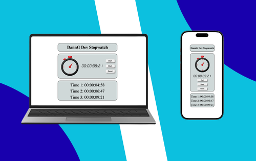

<h1>🕒 DannG‑Dev Cronometer</h1>
 
 

A modern and responsive web stopwatch built with HTML, CSS, and JavaScript — created to demonstrate front‑end fundamentals such as time logic, DOM manipulation, and clean UI design.

 
 
<h1>🔗 Live Demo (GitHub Pages):</h1>
 
(https://danngdev.github.io/DannG-Dev-Cronometer/)
 
 
<h1>📌 About the Project</h1>
 

DannG‑Dev Cronometer is an interactive web‑based stopwatch that allows users to start, pause, mark laps, and reset time. The project focuses on simplicity, clarity, and smooth user interaction, making it a solid example of core JavaScript logic applied to a real UI.

This project is part of my front‑end development portfolio and was intentionally built without frameworks, highlighting my understanding of vanilla JavaScript and browser APIs.

 
 
<h1>🚀 Features</h1>
<ul> 
  <li>Start and pause the stopwatch</li>
  <li>Register lap times</li>
  <li>Reset the timer</li>
  <li>Display hours, minutes, seconds, and milliseconds</li>
  <li>Clean and responsive interface</li>
</ul>
 
 
<h1>🧰 Technologies Used</h1>
 
<ol>
  <li>  - Semantic structure and layout</li>
  <li>  - Styling, layout, and responsiveness</li>
  <li>  - Time calculation, event handling, and DOM manipulation</li>
</ol>
 

No external libraries or frameworks were used.

 
<h1>🤝 Contributions</h1>
 

This project is open‑source. Feel free to fork it, open issues, or submit pull requests.

